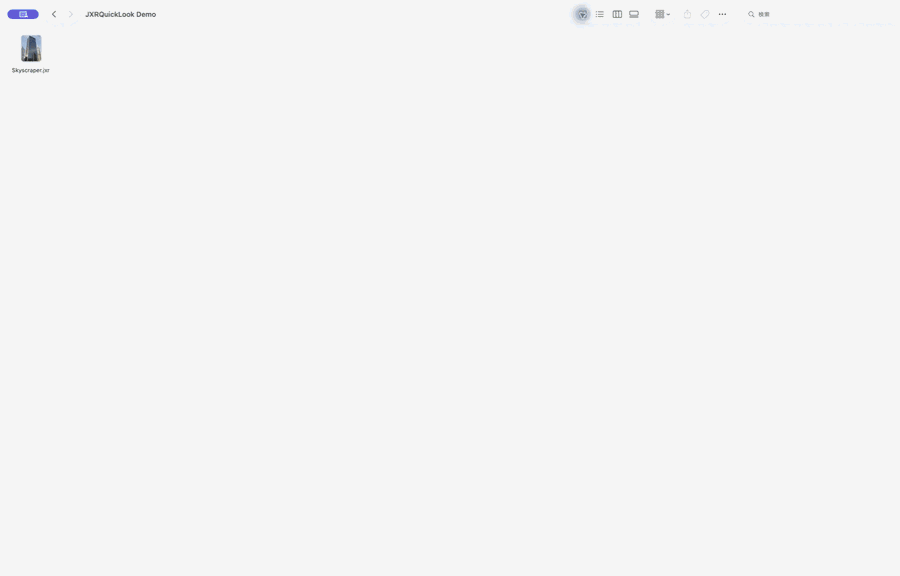

# JXRQuickLook

<p align="center">
  
</p>

JXRQuickLook adds native JPEG XR previews and thumbnails to Finder on macOS.
After installing and launching the app, select a `.jxr`, `.wdp`, or `.hdp` file
and press Space to preview it with Quick Look.

The project is particularly focused on HDR JPEG XR screenshots. HDR previews
are rendered as 32-bit floating-point RGBA images in Extended Linear sRGB,
while Finder thumbnails are tone-mapped to SDR sRGB for consistent icon-view
display.

## Download

Download the latest signed and notarized universal macOS build from
[GitHub Releases](https://github.com/kausui/JXRQuickLook/releases/latest).
Unzip the archive, move `JXRQuickLook.app` to the Applications folder, and
launch it once so macOS can register the bundled Quick Look extensions.

## Features

- Space-bar Quick Look previews in Finder
- Finder thumbnail generation with aspect-correct layout
- HDR and extended-range JPEG XR decoding
- SDR tone mapping for thumbnails
- Native JPEG XR reduced-resolution decoding for large images
- Support for the `.jxr`, `.wdp`, and `.hdp` filename extensions
- A bundled decoder, with no external runtime dependency

## Requirements

- macOS 13 or later
- Xcode 15 or later
- Apple Silicon is tested; Intel Macs are currently untested

## Build and Run

1. Clone the repository.
2. Open `JXRQuickLook.xcodeproj` in Xcode.
3. Select the `JXRQuickLook` scheme and the **My Mac** destination.
4. Select a development team under **Signing & Capabilities** if Xcode asks
   you to sign the app and its extensions.
5. Run the app once with Command-R.
6. In Finder, select a JPEG XR file and press Space.

Keep the built app in a stable location when testing outside Xcode. macOS
registers the preview and thumbnail extensions from the containing app.

If Finder continues to show an older cached thumbnail, run:

```sh
qlmanage -r cache
killall Finder
```

## Project Structure

```text
JXRQuickLook/                  Host macOS application
JXRPreviewExtension/          Space-bar Quick Look preview extension
JXRThumbnailExtension/        Finder thumbnail extension
Packages/JXRDecoder/          Swift and C decoding layer
  Sources/CJXR/Vendor/        Bundled JPEG XR reference implementation
```

## HDR and Image Size

The preview extension currently decodes up to a 4096-pixel longest edge. A
3840 x 2160 RGBA Float image requires approximately 127 MiB for its primary
pixel buffer. Core Graphics, Core Animation, the decoder, and the GPU may
allocate additional copies, so the actual peak memory usage is higher.

Quick Look ultimately controls the on-screen window size. The extension asks
for a maximum preferred size of 7680 x 7680 points, but macOS constrains the
window to the available display area. The 4096-pixel decode limit is currently
an experimental setting intended for memory and image-quality testing.

## Compatibility and Known Limitations

- The decoder is optimized for RGB, RGBA, grayscale, and HDR screenshot input.
- Decoded previews are currently treated as opaque. An alpha plane stored in a
  JPEG XR file is not preserved in the displayed preview.
- Some uncommon advanced JPEG XR output formats, including YCC variants and
  CMYK Direct, are not supported yet.
- Extremely large conformance boundary images are rejected to avoid excessive
  memory allocation.
- The ITU-T T.834 (2014) conformance suite was used during development. The
  current decoder successfully processed 516 of its 537 JPEG XR files; the
  remaining cases are the advanced formats and boundary images described
  above.
- The exact memory budget for a Quick Look extension is not documented by
  Apple and may vary across macOS versions and machines.

## Implementation Notes

`JXRDecoder` wraps the JPEG XR reference implementation in a small C API and a
Swift interface. The preview path creates an Extended Linear sRGB `CGImage`
using floating-point components. The thumbnail path converts the decoded
linear values to an SDR sRGB image before returning it to Quick Look
Thumbnailing.

Large JPEG XR images use the codec's native power-of-two thumbnail decoding,
rather than decoding the entire source and resizing it afterward.

## Third-Party Code

The codec sources under
`Packages/JXRDecoder/Sources/CJXR/Vendor/` are vendored from
[`4creators/jxrlib`](https://github.com/4creators/jxrlib), revision `f752187`
(2017-06-15). That repository identifies itself as a mirror of the JPEG XR
reference implementation originally released by Microsoft from its CodePlex
project.

The vendored codec is Copyright Microsoft Corp. and is distributed under the
BSD 2-Clause License. The copyright notice and license apply to the vendored
code even if JXRQuickLook is distributed under a different project-level
license.

See [`THIRD_PARTY_NOTICES.md`](THIRD_PARTY_NOTICES.md) for provenance details
and [`Packages/JXRDecoder/LICENSE-jxrlib.txt`](Packages/JXRDecoder/LICENSE-jxrlib.txt)
for the complete upstream license text.

The `CJXR` wrapper, Swift interface, HDR conversion code, and Quick Look
extensions are JXRQuickLook-specific code and are not part of upstream
`jxrlib`.

No license has yet been declared for the original JXRQuickLook source code.
Choose and add a project-level license before accepting external
contributions or redistributing modified builds.
